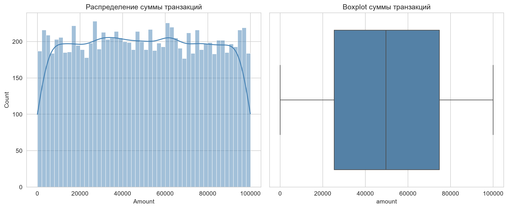
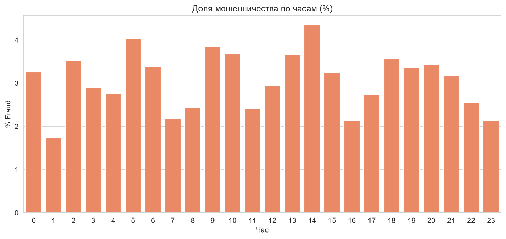
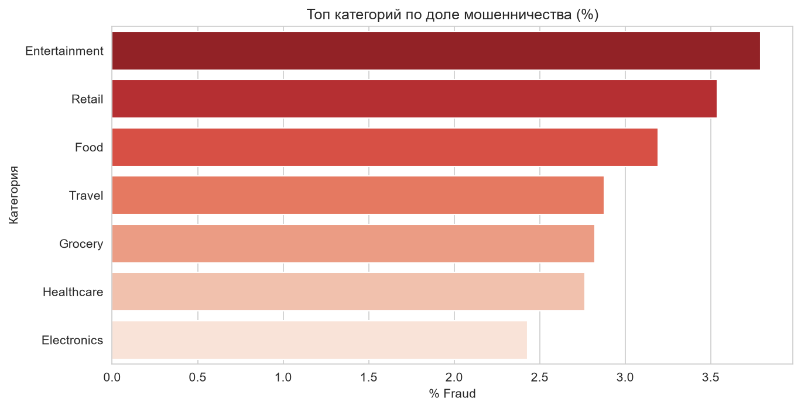

# FinTech Transaction Analysis

## Описание проекта
Исследовательский анализ (EDA) финансового датасета **Financial Transaction Intelligence Dataset 2026**.  
Цель — изучить поведение клиентов, паттерны трат и сигналы мошенничества в цифровых платежах.

## Данные
- Источник: [Financial Transaction Intelligence Dataset 2026 (Kaggle)](https://www.kaggle.com/datasets/roshaaann30/financial-transaction-intelligence-dataset-2026)
- Период: январь 2025 — май 2026
- Объём: 10 000 транзакций
- Таблицы: customers, merchants, transactions, cards, devices

## Инструменты
- Python 3.11
- pandas, numpy, matplotlib, seaborn
- Jupyter Notebook

## Визуализации

### Распределение суммы транзакций


### Доля мошенничества по часам


### Рискованные категории


## Основные инсайты
- Доля мошеннических транзакций: **3.06%**
- Средний чек почти не отличается между обычными и мошенническими операциями
- Повышенный риск мошенничества в **5:00, 9:00 и 14:00**
- Наиболее рискованные категории: **Entertainment**, **Retail**, **Food**
- Отдельные признаки слабо разделяют fraud и normal — нужна комбинация факторов

## Рекомендации
1. Усилить мониторинг в категориях Entertainment и Retail
2. Добавить дополнительные проверки в часы повышенного риска
3. Использовать комбинацию поведенческих признаков вместо одного показателя
4. Углубить анализ устройств и геолокации

## Структура проекта
```
01-fintech-transaction-analysis/
├── data/                  # исходные данные
├── notebooks/             # Jupyter-ноутбук с анализом
├── images/                # графики и скриншоты
├── README.md
└── .gitignore
```

## Как воспроизвести
1. Создайте окружение `analysis`
2. Установите библиотеки: pandas, numpy, matplotlib, seaborn
3. Запустите ноутбук `notebooks/01_eda_fintech_transactions.ipynb`

## Автор
Veta Suhih | Junior Data Analyst  
GitHub: [veta-suhih](https://github.com/veta-suhih) | LinkedIn: [vetasuhih](www.linkedin.com/in/vetasuhih)